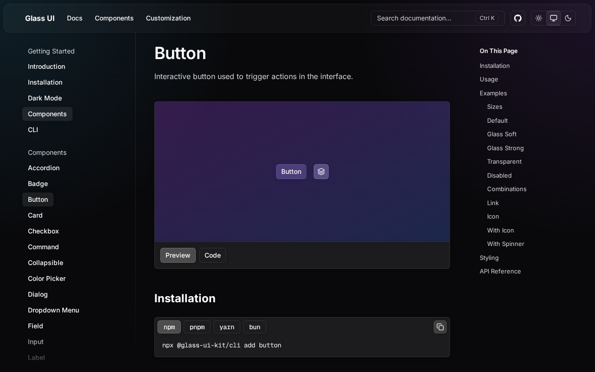

<div align="center">

# Glass UI

<a href="https://ui-glass.vercel.app/docs/components/button">
  
</a>

[Documentation](https://ui-glass.vercel.app) &middot; [Components](https://ui-glass.vercel.app/docs/components) &middot; [npm](https://www.npmjs.com/package/@glass-ui-kit/cli)

Accessible glassmorphism components for React and Tailwind CSS.

</div>

## About

Glass UI is a collection of reusable components that you copy into your project and own. Use the CLI to scaffold accessible, type-safe components, then customize every detail to fit your interface.

## Stack

- **UI** — [React](https://react.dev)
- **Language** — [TypeScript](https://www.typescriptlang.org)
- **Styling** — [Tailwind CSS](https://tailwindcss.com)
- **Documentation** — [Astro](https://astro.build)
- **Workspace** — [Turborepo](https://turbo.build) / [pnpm](https://pnpm.io)

## Quick Start

Initialize Glass UI in your project:

```bash
npx @glass-ui-kit/cli@latest init
```

Add a component:

```bash
npx @glass-ui-kit/cli@latest add card
```

The generated source code lives in your project, ready to edit without depending on a component package.

## Development

1. Clone the repository:

```bash
git clone https://github.com/jntellez/glass-ui.git
cd glass-ui
```

2. Install dependencies:

```bash
pnpm install
```

3. Start the development server:

```bash
pnpm dev
```

4. Open [http://localhost:4321](http://localhost:4321) in your browser.

## Structure

- `apps/web` — Documentation site and component registry
- `packages/cli` — CLI for scaffolding components
- `packages/glass` — Source of truth for reusable components

## License

[MIT](LICENSE) © Juan Tellez
